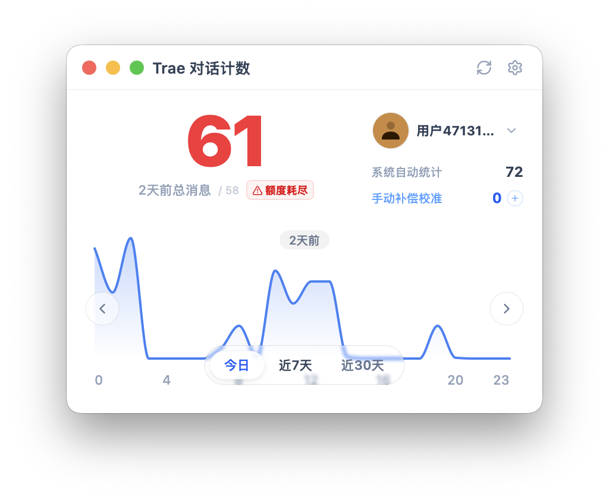
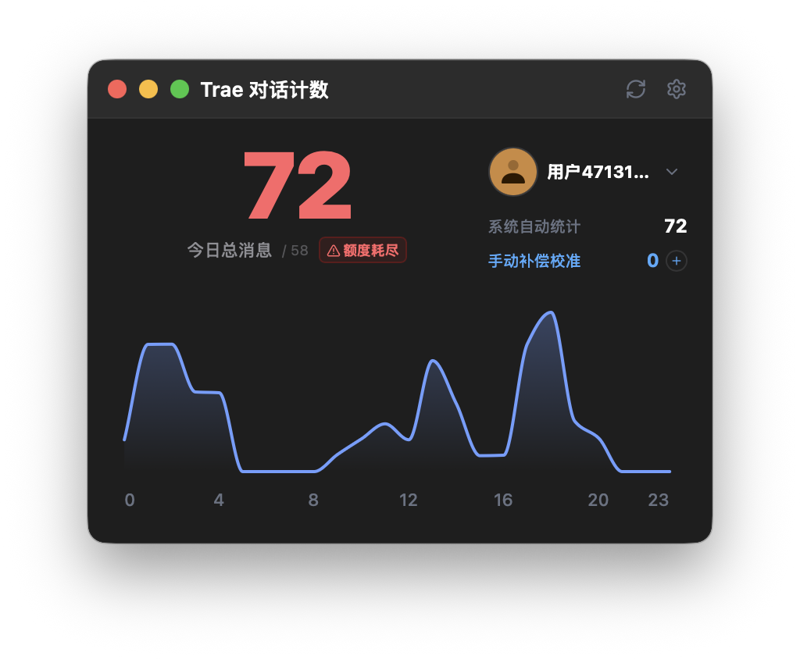
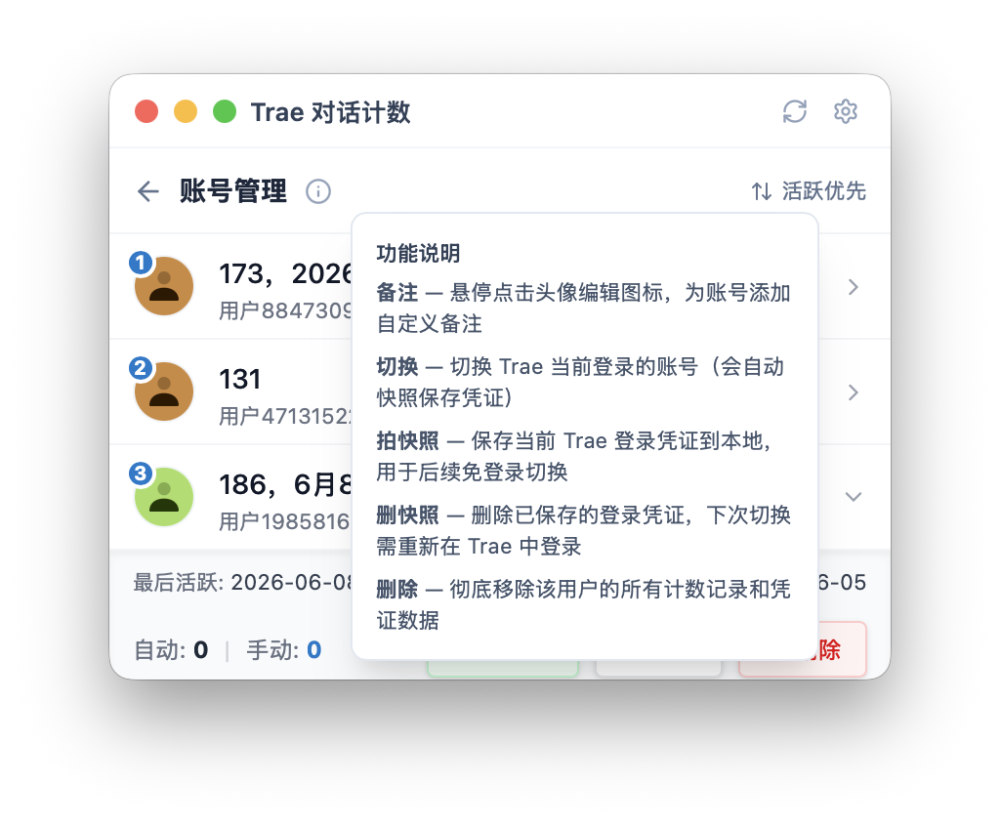
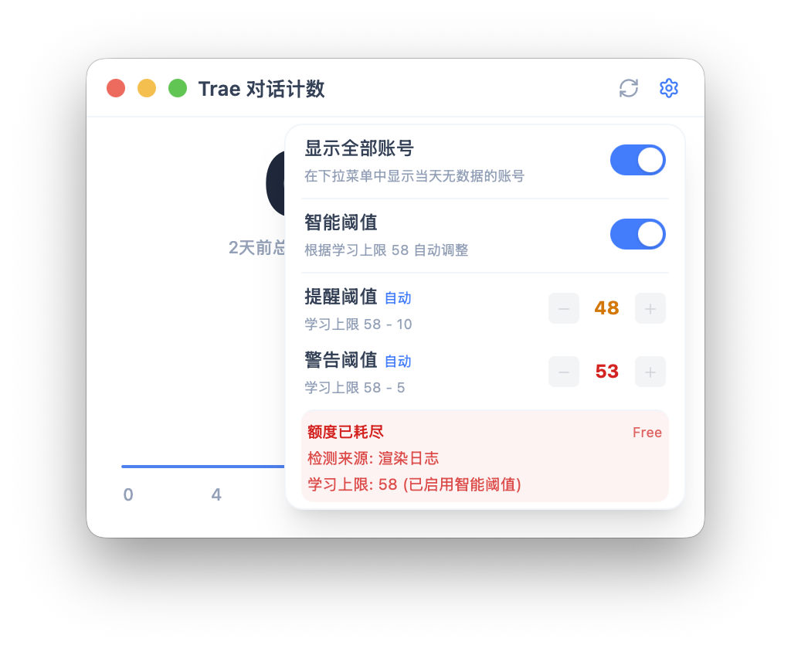

# Trae 对话计数

追踪每日 Trae IDE 对话消息数量，支持多用户统计、额度提醒、Touch Bar 显示

## 功能截图

| 浅色模式 | 深色模式 |
| :---: | :---: |
|  |  |

| 账号管理 | 设置面板 |
| :---: | :---: |
|  |  |

## 功能特性

- **实时对话计数** -- 自动追踪每日对话消息数量
- **多用户管理** -- 支持多账号切换和独立统计
- **额度提醒** -- 自动检测剩余额度并提醒
- **Touch Bar 支持** -- 在 MacBook Touch Bar 上显示计数
- **流体图表** -- 动态展示使用趋势
- **深色/浅色模式** -- 自动适配系统主题

## 安装方式

1. 从 [GitHub Release](https://github.com/MuCoreBenC/TraeCounter/releases) 下载最新版 DMG
2. 打开 DMG，将应用拖拽到 Applications 文件夹
3. 首次打开时，macOS 可能提示"无法验证开发者"或"应用已损坏"，这是正常现象（应用未签名），请按以下步骤操作：

### 解决"应用已损坏"提示

打开终端（Terminal），复制粘贴以下命令并回车（需要输入电脑登录密码）：

```bash
sudo xattr -r -d com.apple.quarantine /Applications/Trae对话计数.app
```

执行后即可正常打开应用。

> 如果从 DMG 中直接双击应用也提示损坏，可先执行：
> ```bash
> xattr -d com.apple.quarantine "/Volumes/Trae 对话计数/Trae对话计数.app"
> ```

## 关于本项目的开源方式

本项目采用"前端开源 + Go 外壳公开 + 核心包保密"的方式：

- **前端源码**（React / TypeScript）完全开放，欢迎学习和参考
- **Go 项目的入口文件和 API 层代码**公开，展示项目架构
- **核心算法包**（`internal/counter`、`internal/store`、`internal/traedb`、`internal/native`）以预编译二进制形式提供，源码暂不公开
- Go 代码仅供参考，无法独立编译
- 完整可运行的应用请从 GitHub Release 下载预编译二进制

感谢理解和支持！

## 技术栈

| 层级 | 技术 |
| --- | --- |
| 后端 | Go + Wails v2 |
| 前端 | React + TypeScript + Tailwind CSS |
| 数据库 | SQLite |

## 许可证

[CC BY-NC 4.0](https://creativecommons.org/licenses/by-nc/4.0/)
