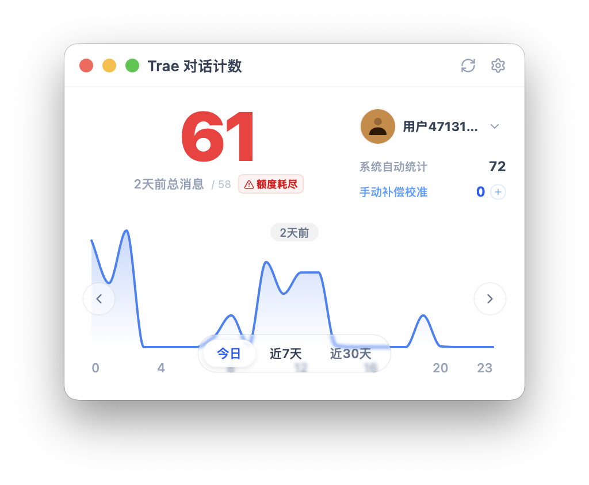
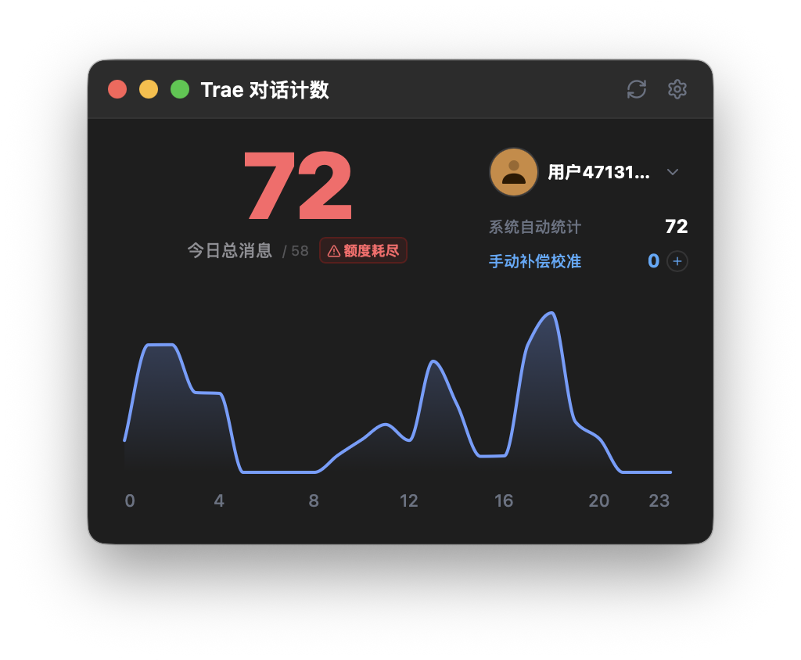
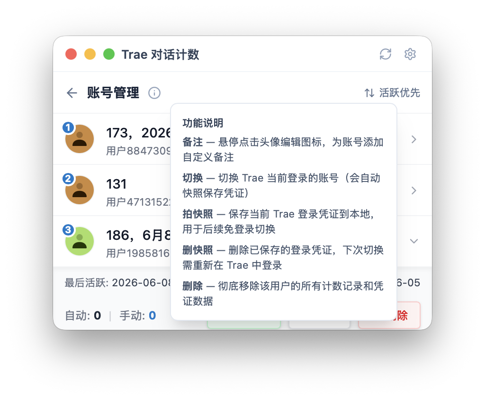
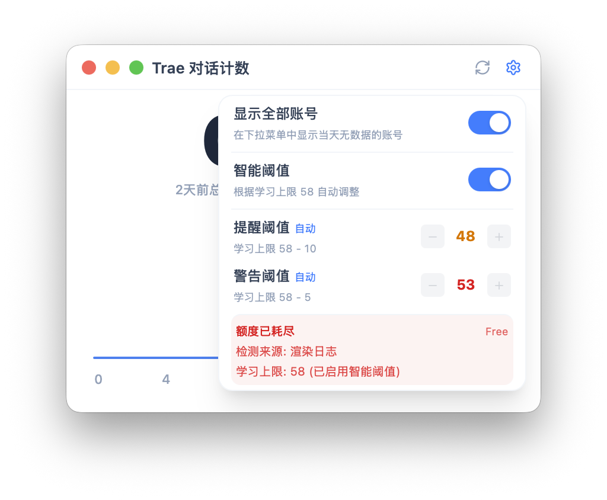

# Trae 对话计数

一个 macOS 桌面小工具，实时追踪你在 Trae IDE 中的对话次数，在额度耗尽前提醒你，让你不再在关键时刻被限制打断。

## 功能截图

| 浅色模式 | 深色模式 |
| :---: | :---: |
|  |  |

| 账号管理 | 设置面板 |
| :---: | :---: |
|  |  |

## 功能特性

- **实时对话计数** -- 自动追踪每日对话消息数量，新消息秒级更新
- **多用户管理** -- 支持多账号切换和独立统计，优先显示备注名
- **额度提醒** -- 接近额度上限时自动提醒，日/周双维度检测
- **额度校准** -- 到达上限后用服务端精确数值校准并锁定计数
- **智能阈值** -- 根据学习到的额度上限自动设置提醒/警告阈值
- **趋势图表** -- 日/周/月/年视图切换，动态展示使用趋势
- **Touch Bar 支持** -- 在 MacBook Touch Bar 上显示计数
- **深色/浅色模式** -- 自动适配系统主题

## 安装方式

1. 从 [GitHub Release](https://github.com/MuCoreBenC/TraeCounter/releases) 下载最新版 DMG
2. 打开 DMG，将应用拖拽到 Applications 文件夹
3. 首次打开时，macOS 可能提示"无法验证开发者"或"应用已损坏"，这是正常现象（应用未签名），请按以下步骤操作：

### 解决"应用已损坏"提示

打开终端（Terminal），复制粘贴以下命令并回车（需要输入电脑登录密码）：

```bash
sudo xattr -r -d com.apple.quarantine /Applications/Trae对话计数.app
```

执行后即可正常打开应用。

> 如果从 DMG 中直接双击应用也提示损坏，可先执行：
> ```bash
> xattr -d com.apple.quarantine "/Volumes/Trae 对话计数/Trae对话计数.app"
> ```

## 关于本项目的开源方式

本项目采用"前端开源 + 核心包保密"的方式：

- **前端源码**完全开放，欢迎学习和参考
- **核心算法包**以预编译二进制形式提供，源码暂不公开
- 完整可运行的应用请从 GitHub Release 下载

感谢理解和支持！

## 许可证

[CC BY-NC 4.0](https://creativecommons.org/licenses/by-nc/4.0/)
